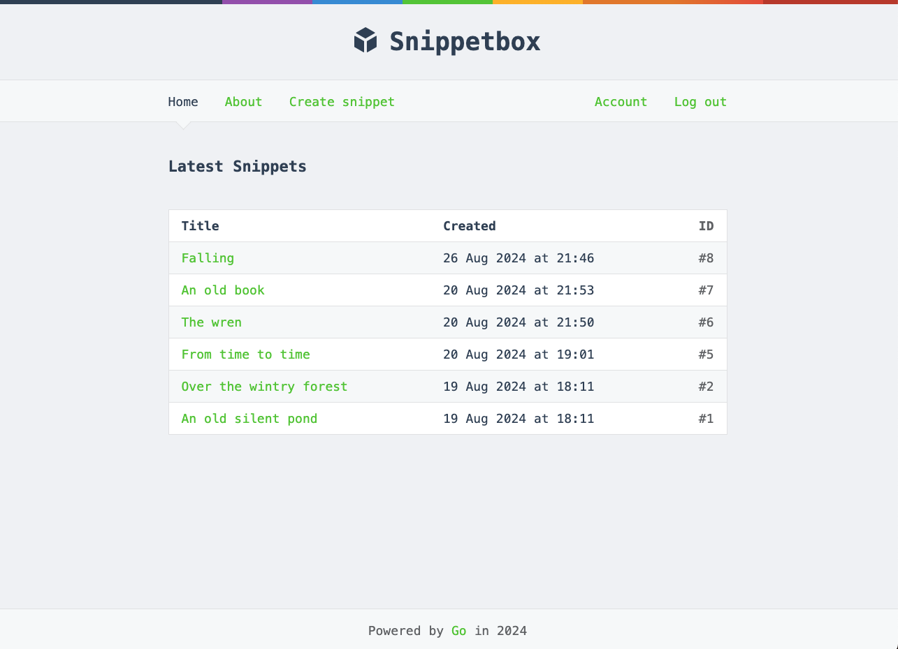

# Snippetbox
Snippetbox is a simple web application written in Go that allows users to create, view, and manage text snippets, similar to Pastebin. This project was created in following Alex Edwards's Let's Go book. Follow the instructions below to set up and access the program locally.



## Installation
#### 1. Clone the repository
```shell
$ git clone https://github.com/yhavin/snippetbox.git
$ cd snippetbox
```

#### 2. Update module path
The default module path is `snippetbox.yhavin`. To update this, open [`module.sh`](./module.sh) and change the `NEW_MODULE_NAME` variable. Make the script executable and run it.
```shell
$ chmod +x module.sh
$ ./module.sh
```

#### 3. Install dependencies
```shell
$ go mod tidy
```

#### 4. Set up the database
Use the [`setup.sql`](./setup.sql) script, which will create the `snippetbox` database, a non-root user, and the `snippets` and `users` tables. See [MySQL setup](#mysql-setup) below for help installing and setting up MySQL.
```shell
$ mysql -u root -p < setup.sql
```

#### 5. Generate TLS certificates
```shell
$ mkdir tls
$ cd tls
$ go env GOROOT  # To find where your Go source code installed
$ go run <YOUR_GOROOT_HERE>/src/crypto/tls/generate_cert.go --rsa-bits=2048 --host=localhost

# For many users, this will be
$ go run /usr/local/go/src/crypto/tls/generate_cert.go --rsa-bits=2048 --host=localhost
OR
$ go run /usr/local/Cellar/go/<version>/libexec/src/crypto/tls/generate_cert.go --rsa-bits=2048 --host=localhost
```

#### 5. Run the application
```shell
# Build and then run
$ go build -o snippetbox ./cmd/web
$ ./snippetbox

# Run directly
$ go run ./cmd/web
```

Open your browser to [`https://localhost:4000`](https://localhost:4000). Your browser will complain that it is not secure, but proceed anyway: this warning is caused by the TLS certificate being self-signed. This is completely fine for development/local usage.

## MySQL setup
#### 1. Install MySQL
```shell
# Homebrew (macOS)
$ brew install mysql

# Ubuntu/Debian
$ sudo apt-get install mysql-server
```

Windows: Download from the [official MySQL website](https://dev.mysql.com/downloads/installer/).

#### 2. Start MySQL server
```shell
# Homebrew (macOS)
$ brew services start mysql

# Ubuntu/Debian
$ sudo systemctl start mysql

# Windows
$ net start MySQL
```

#### 3. Set root password
```shell
# Homebrew (macOS)
$ mysql -u root
OR
$ sudo mysql

# Ubuntu/Debian
$ sudo mysql

# Windows
Will be prompted during installation
```

Now you can continue setting up the database and running the application.